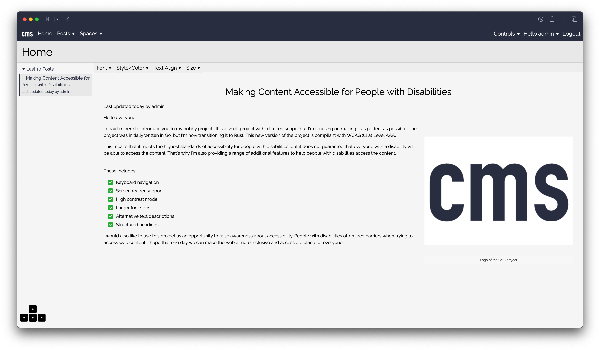

# CMS 2



CMS 2 is a CMS written in Rust. It is a work in progress.

It is a hobby project to learn Rust and to create a CMS that is easy to use and easy to deploy.

The CMS 2 is aiming to be fully accessible.

## Deploy CMS 2

### Rust

You will need to have [Rust](https://www.rust-lang.org/) installed on your system.

```bash
curl --proto '=https' --tlsv1.2 -sSf https://sh.rustup.rs | sh
source "$HOME/.cargo/env"
rustup update
```

### Podman

You will need to have [Podman](https://podman.io/) installed on your system.

### CMS-2

#### 1. Deploy MySQL database:

```bash
export MYSQL_ROOT_PASSWORD=roottoor
export MYSQL_DATABASE=cms
export MYSQL_USER=cms
export MYSQL_PASSWORD=cmspassword
podman run --name cms-backend-db -p 3307:3306/tcp -e MYSQL_ROOT_PASSWORD -e MYSQL_DATABASE -e MYSQL_USER -e MYSQL_PASSWORD -d mariadb:latest
```

#### 2. Setup the DB:

```bash
sea-orm-cli migrate up
```

### Deploy CMS:

```bash
cargo run --release
```

